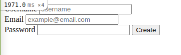

# re-former

This project helps us understand how rails databases work and how we can relate a form with a database.
This particular database contains 3 keys:
- Users
- email
- password

# Screenshot



# Build With

- Ruby
- Rails

# Getting Started

To install this project on your machine follow this steps:
- Download a clone locally ```git clone https://github.com/greg0109/re-former```
- Enter the project folder ```cd re-former```
- Download the proper branch ```git checkout form```
- Install the necessary gems ```bundle install```
- Migrate the database ```rails db:migrate```
- Open the rails server ```rails server```
- You can now access the app on ```https://localhost:3000/users/new```

# Authors

👤 Gregorio Rábago Sainz

- GitHub: [@Greg0109](https://github.com/greg0109)
- Twitter: [@Greg_0109](https://twitter.com/greg_0109)

👤 Salley Iddrisu

- GitHub: [@juxsalley](https://github.com/juxsalley)
- Twitter: [@__salley](https://twitter.com/__salley)

## 🤝 Contributing

Contributions, issues, and feature requests are welcome!

Feel free to check the [issues page](https://github.com/greg0109/re-former/issues).

## Show your support

Give a ⭐️ if you like this project!

## 📝 License

This project is [MIT](LICENSE) licensed.

